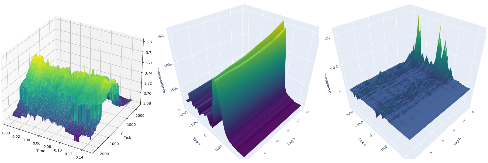

Welcome to my webpage!  My name is Jimmy Risk, an assistant professor of [mathematics and statistics](https://www.cpp.edu/sci/mathematics-statistics/) at [Cal Poly Pomona](https://www.cpp.edu/).  I enjoy travelling, hiking, playing pickleball, and learning Mandarin and 繁體中文.

Below you will find my contact information along with a brief introduction to my research.  You can find more detailed information by using the quick-links up top.

# Contact Information

Jimmy Risk \
Associate Professor \
Cal Poly Pomona \
3801 W Temple Ave, Pomona CA 91768\
Department of Mathematics and Statistics\
Room 8-202\
``(+1) (231) 633 1473``\
``jrisk (at) cpp (dot) edu``

# Developed and Maintained Software Packages

## EasyGPR: A User-Friendly Gaussian Process Regression Package

[EasyGPR](https://github.com/jimmyrisk/EasyGPR) is a Python package that I developed to simplify Gaussian Process Regression (GPR) for a wide range of users, especially those familiar with R. It serves as a streamlined wrapper around the GPyTorch library, offering a similar functionality and syntax to the DiceKriging package in R. EasyGPR focuses on ease of use, making Gaussian Process Regression accessible and statistically robust for various applications. This package exemplifies my commitment to bridging the gap between complex statistical methods and practical usability in research and industry.

# Research Interests and Projects

## Research Interests

My research primarily focuses on **Gaussian Processes (GPs)**, a Bayesian non-parametric modeling method, which I apply across various disciplines. I am particularly interested in the following areas:

* **Gaussian Processes and Applications**: Exploring novel covariance functions to enhance the expressivity and interpretability of GPs, enabling their use in diverse applications such as image super-resolution and advanced classification tasks in computer vision.

* **Financial Mathematics and Quantitative Risk Management**: Investigating GP-based techniques for risk assessment and option pricing, including quantile loss estimation and efficient Monte Carlo simulations. I am also interested in modeling liquidity dynamics in decentralized finance platforms and integrating GPs with stochastic volatility models.

* **Actuarial Science and Mortality Modeling**: Utilizing GPs and genetic algorithms to develop nuanced mortality models that capture age-period-cohort effects. This approach aims to improve the precision and interpretability of mortality forecasts essential for insurance and pension planning.

* **Sports Analytics and Mathematical Finance**: Creating innovative player valuation frameworks by combining financial models with network theory to assess player market values dynamically. Additionally, I explore the application of stochastic control methods to optimize team performance strategies throughout a season.

* **Machine Learning and Data Science**: Focusing on kernel expressivity and model interpretability within machine learning. I design novel covariance functions to better capture complex data structures, facilitating transparent and interpretable solutions in areas such as image processing and classification.

### Current Research Projects

#### Empirical Analysis of Decentralized Exchange Liquidity Surfaces

*(Collaboration with [Dr. Tai-Ho Wang (Baruch College)](https://baruch.cuny.edu/) and [Dr. Shen-Ning Tung (National Tsing Hua University)](https://www.nthu.edu.tw/))* 

Liquidity is a cornerstone of financial markets, and its dynamics in decentralized exchanges like Uniswap v3 present unique challenges. This project pioneers the first comprehensive empirical analysis of liquidity surfaces within the Uniswap v3 framework. Utilizing **Gaussian Processes (GPs)**, we aim to capture the complex spatiotemporal dynamics of liquidity across various price levels and time intervals. Our analysis focuses on multiple liquidity pools, examining how concentrated liquidity provision impacts market efficiency and stability.

  

**Modeling Framework**  
We model the log-liquidity as a latent function \( f(x, t) \), where \( x \) represents tick levels and \( t \) denotes time. The GP framework allows us to flexibly capture non-linear relationships and provide robust uncertainty quantification. Preliminary results demonstrate the effectiveness of GPs in forecasting liquidity trends and identifying key factors influencing liquidity provision.

**Preliminary Findings**  
Our initial analysis reveals significant non-stationarity in liquidity surfaces, necessitating advanced kernel designs to accurately model temporal and spatial dependencies. Comparative studies with traditional parametric models highlight the superior performance of GPs in handling high-dimensional liquidity data, offering valuable insights for liquidity providers and market designers.

---

#### Stochastic Modeling in Sports Analytics and Financial Applications

*(Collaboration with [Dr. Albert Cohen (Michigan State University)](https://www.msu.edu/) and [Dr. Tai-Ho Wang](https://baruch.cuny.edu/))* 

Building on the **Pythagorean expectation** framework originally developed by Bill James, this project develops dynamic models that integrate mathematical finance with sports analytics that can be used to rigorously price financial derivates in betting markets.

**Key Focus Areas:**
- **Dynamic Pythagorean Models:** Extending the traditional Pythagorean expectation to a dynamic setting, allowing parameters to vary over time to capture evolving team performance.
- **Barrier Options in Sports Betting:** Exploring financial derivatives analogous to barrier options, where payoffs depend on performance metrics crossing specific thresholds. This innovation provides new opportunities in the sports betting market.
- **Model Improvements:** Addressing observed inconsistencies in existing models by incorporating decreasing variance and handling large shocks in performance metrics. Developing stochastic differential equation (SDE) systems to enhance model accuracy and tractability for derivative pricing.

---

#### Optimal Control in Dynamic Sports Models

*(Collaboration with [Dr. Albert Cohen](https://www.msu.edu/) and [Dr. Tai-Ho Wang](https://baruch.cuny.edu/))* 

Building upon our work in sports analytics, this project applies **stochastic control theory** to optimize team performance strategies over a season. By treating the Pythagorean exponent \( \gamma_t \) as a dynamic control variable, we develop models that allow teams to adjust their strategies in real-time to achieve desired performance outcomes. This approach provides a mathematical foundation for decision-making processes in team management, balancing consistency and adaptability.  This research is the first to bridge theoretical control models and practical sports management relating to the seminal work by Bill James, offering actionable insights for coaches and team managers.

**Model Development**  
We construct a system of stochastic differential equations (SDEs) that govern the dynamics of team performance metrics, incorporating control variables that represent strategic adjustments. The optimal control distribution is derived to minimize a value function that captures performance goals and strategic costs that can be chosen by managers and coaches.

---

## Gaussian Process Super-Resolution (GPSR)

*Super-resolution* is the term of enlarging low-resolution images while restoring *high-frequency details*.  A *Gaussian process* is a specific type of model that can be used for this task.

* See the **low-resolution** image of the stairs below, whose **ground-truth** is presented next to it.  
* Two Gaussian processes are applied to this image (one with the linear kernel and one with the Laplace kernel) to attempt to restore the low-resolution image to the ground truth
  * The models are not allowed to have the ground-truth available to them!

| Low-Resolution | Ground Truth | Linear Kernel | Laplace Kernel  |
|:---:|:---:|:---:|:---:|
| <image src = "SC2_LR.png" width="219px" height="219px"></image> | <image src = "SC2_GT.png" width="219px" height="219px"></image> |<image src = "SC2_DP.png" width="219px" height="219px"></image> | <image src = "SC2_EXP.png" width="219px" height="219px"></image> |

* Our work involves *kernel analysis* for this task.
* Current research sticks with a "tried-and-true" kernel (linear, or RBF).  
* However, we find improvements in using other kernels, like the *Laplace kernel*, which specifically allows for sharp transitions in pixel intensity.
* See enlarged details below.

| Linear Kernel (Zoomed In)  | Laplace Kernel (Zoomed In) |
|---|---|
| <image src = "SC2_DP1.png" width="260px" height="120px"></image> | <image src = "SC2_EXP1.png" width="260px" height="120px"></image> |

* This work is currently on hold due to hardware failure, but the code is being refactored to work with GPyTorch, a highly efficient and modular implementation of GPs, with GPU acceleration.  This refactoring will allow for promising future research in GPSR including multi-output GPs (e.g. over color channels or patches), and sparse/variational GPs for near real-time GPSR.

